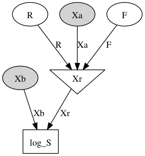

# Mental Rotation Project

Jessica B. Hamrick (jhamrick@berkeley.edu)  
Thomas L. Griffiths (tom_griffiths@berkeley.edu)

## Overview

Given a computational resource--for example, the ability to visualize
an object rotating--how do you best make use of it? This project
explores how mental simulation should be used in the classic
psychological task of determining if two images depict the same object
in different orientations.

## Project Layout

* `config.ini`: configuration variables/parameters/settings
* `bin/`: scripts for running simulations, munging data, generating
  stimuli, etc.
* `data/`: human experimental data and model simulation data
* `experiment/`: files necessary to run the Mechanical Turk
  experiment
* `figures/`: figures for slides/papers
* `lib/`: contains the `mental_rotation` Python package, which
  includes the majority of the relevant code
* `man/`: manuscripts, slides, reviews, etc.
* `stimuli/`: stimuli files for use in experiments and simulations
* `tests/`: test suite for the `mental_rotation` Python package

## Stimuli

Stimuli can be found in the `stimuli/` folder (or you can use the
`mental_rotation.STIM_PATH` variable, which is configurable in
`config.ini`), and can be loaded using the `Stimulus2D` class:

```
from mental_rotation import STIM_PATH
from mental_rotation.stimulus import Stimulus2D
X = Stimulus2D.load(STIM_PATH.joinpath("A", "000_120_0.json"))
```

## Models

The models for the project are part of the Python package, accessible
from `mental_rotation.model` in Python or `lib/mental_rotation/model/`
in the directory structure.

All models are subclasses of `mental_rotation.model.BaseModel`, which
is a subclass of the `pymc.Sampler` class. The models take samples of
`log_S` in the following Bayes' net:



From these samples, the models estimate the integral $$Z = \int S(X_b,
X_r)p(R)\ \mathrm{d}R$$.
 
All models are instantiated with two parameters, `Xa` and `Xb`, which
correspond to the presented images. Both `Xa` and `Xb` should be
`Stimulus2D` objects.

Example code for all the models can be found in
`lib/mental_rotation/analysis/models.ipynb`.

### Gold Standard Model

Located in `lib/mental_rotation/model/gold_standard.py` or
`mental_rotation.model.GoldStandardModel`. The gold standard model
takes a sample from `log_S` at every integer degree (e.g.,
[0, 1, ..., 359, 360]) and uses the trapezoidal rule to estimate the
integral.

```
from mental_rotation.model import GoldStandardModel
gs_model = GoldStandardModel(Xa, Xb)
gs_model.sample()
gs_model.print_stats()
```

### Hill Climbing Model

Located in `lib/mental_rotation/model/hill_climbing.py` or
`mental_rotation.model.HillClimbingModel`. The hill climbing model
performs gradient descent and stops when it reaches a local
maximum. It takes samples from `log_S` every 10 degrees along the way
and uses the trapezoidal rule to estimate the integral.

```
from mental_rotation.model import HillClimbingModel
hc_model = HillClimbingModel(Xa, Xb)
hc_model.sample()
hc_model.print_stats()
```

### Bayesian Quadrature Model

Located in `lib/mental_rotation/model/bayesian_quadrature.py` or
`mental_rotation.model.BayesianQuadratureModel`. The Bayesian
quadrature model uses the `BQ` object (see below) to estimate a
distribution over $$Z$$. It chooses points that will result in the
lowest expected $$Var(Z)$$, and it samples from `log_S` every 10
degrees along the way. Once the model is confident in its estimate of
$$Z$$, it will stop.

```
from mental_rotation.model import BayesianQuadratureModel
bq_model = BayesianQuadratureModel(Xa, Xb)
bq_model.sample()
bq_model.print_stats()
```

#### Bayesian Quadrature Object

The `BQ` class (located in `lib/mental_rotation/extra/bq.py`, or
`mental_rotation.extra.BQ`) does all the heavy lifting with regards to
computing the Bayesian Quadrature estimate. It implements the
algorithm described in Osborne et al. (2012).

```
from mental_rotation import config

gamma = config.getfloat("bq", "gamma")
ntry = config.getint("bq", "ntry")
n_candidate = config.getint("bq", "n_candidate")
R_mean = config.getfloat("model", "R_mu")
R_var = 1. / config.getfloat("model", "R_kappa")

x = np.random.uniform(-8, 8, 30)
y = scipy.stats.norm.pdf(x, 0, 1)
bq = BQ(x, y, gamma, ntry, n_candidate, R_mean, R_var, s=0)
bq.fit()
print bq.Z_mean(), bq.Z_var()
```

The relevant methods are:

* `BQ.fit()`: finds the MLII estimates for the Gaussian Process
  hyperparameters
* `BQ.S_mean(R)`: computes the estimated mean of `S` at points `R`.
* `BQ.S_cov(R)`: computes the estimated covariance of `S` at points
  `R`.
* `BQ.Z_mean()`: computes the estimated mean of `Z`.
* `BQ.Z_var()`: computes the estimated variance of `Z`.
* `BQ.expected_Z_var(x_a)`: computes the expected variance of `Z`
  given a new observation `x_a`.

Underneath the hood, these methods do a lot of analytical computation,
which is implemented using Cython in the extension module
`mental_rotation.extra.bq_c` (or
`lib/mental_rotation/extra/bq_c.pyx`). For the most part, these
functions compute various analytical solutions to integrals of
Gaussians.

Additionally, the `BQ` object relies heavily on the
[Gaussian process](https://github.com/jhamrick/gaussian_processes)
library written by Jessica Hamrick. This library also implements most
of its functionality in Cython.


## Tests

To run tests, go to the root of the project directory and run:

```
make test
```

This also produces a code coverage report, which can be viewed by
opening `htmlcov/index.html`.

## References

* Osborne, M. A., Duvenaud, D., Garnett, R., Rasmussen, C. E.,
  Roberts, S. J., & Ghahramani, Z. (2012). Active Learning of Model
  Evidence Using Bayesian Quadrature. *Advances in Neural Information
  Processing Systems*, 25.
